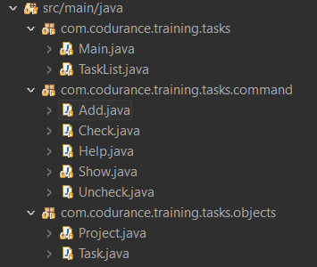
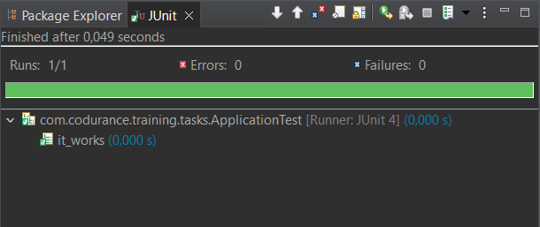

// ------------------------------------------
//  Created by Jean-Michel Bruel on 2019-12.
//  Copyright (c) 2022 IRIT/U. Toulouse. All rights reserved.
// Thanks to Louis Chanoua for contributions
// ------------------------------------------
= DUT-Info/S3/M3105 (CPOA) : Projet refactoring
Jean-Michel Bruel
v22.1, {localdate}
:mailto: jbruel@gmail.com
:status: bottom
:inclusion:
:experimental:
:toc: toc2
:numbered:

// ------------------------------------------

== Refactoring d'un code existant

Vous êtes chargé de prendre la suite d'un développement pour laquelle la
documentation est minimaliste et dont les sources sont disponibles ici :

https://github.com/codurance/task-list/tree/master/java

[%interactive]
* [ ] Replacez et utilisez ce README.adoc comme rapport de votre refactoring.
* [ ] Expliquez comment deployer votre application (e.g., `mvn install` ou `gradle install`)

== Initialisation

. Récupérez les sources du projet :
- soit en clonant le dépôt :
+
..........
git clone https://github.com/codurance/task-list.git
..........
+
- soit en téléchargeant directement le fichier https://github.com/codurance/task-list/archive/master.zip[.zip].
+
WARNING: Attention de bien copier/cloner dans votre workspace, ou en tout cas
sur un répertoire pérenne (conseil valables si vous utilisez les PC des salles machines).
+
. Importez le projet en tant que projet {maven}:
- menu:File[Import...>Maven>Existing Maven Project]
- sélectionnez le fichier `pom.xml` du répertoire `java`
+
[WARNING]
=====
Si vous n'avez pas Maven :

. Créez un projet java
. Importez le répertoire `src` du répertoire `java` en cliquant droit sur votre
paquetage `src` et en choisissant menu:Import[File System].
. Fixez le problème des imports JUnit en ajoutant la librairie (par quickfix)
. Changez la ligne dans `ApplicationTest` : `import org.hamcrest.Matchers.is` par
`import static org.hamcrest.core.Is.*` (merci Hugues, Lino and others).
=====
+
NOTE: Seul le répertoire `java` nous intéresse. Mais n'hésitez pas à regarder
les autres langages si ça vous aide.
+
. Lancez les tests pour vérifier que tout est OK (`ApplicationTest.java`)
. À partir du code de test fourni, déterminez ce que fait
l'application et comment elle fonctionne.

REPONSE : L'application possède quelques commandes qui permettent à l'utilisateur d'enregistrer des tasks (phrase en string) de les classer par catégorie. Il a aussi la possibilité de checker chaque task.

== Travail à effectuer

Vous avez seulement 3 séances de 1,5h en semaines 1 pour améliorer le plus possible le code (sans en changer les fonctionalités ni en ajouter nécessairement) de cette application, en y intégrant vos acquis de l'IUT :

- du module CPOA : intégration de patrons de conception. Cela peut être ceux vus en cours, ou d'autres (il y en a plein sur Internet !),
- du module COO : bonnes pratiques de la conceptions orientée objet. Pensez à `SOLID``, l'encapsulation, votre expérience en développement Java !

WARNING: Commencez d'abord par établir un objectif et vous répartir les tâches ! Vous perdrez énormément de temps si vos changements s'avèrent non adaptés à l'application ! Validez-le ensuite avec votre intervenant de TP, il est là pour vous aider.

TIP: Commencez par le plus simple. Le patron le plus complexe n'est pas toujours le plus adapté !

TIP: Dans votre étude, anticipez de possibles futures évolutions de l'application. Ex: affichage déporté, configuration de plusieurs algorithmes, types de stockages des données... (l'objectif de ce projet est de refactorer le code, pas d'ajouter de nouvelles fonctionnalités).

ifndef::uk[]

== Travail effectué

=== Division du code

Tout d'abord nous avons decider de diviser la classe 'TaskList' en plusieurs Package et Classe.

Comme le montre l'image ci-dessous, nous avons 2 packages : command et objects.

Nous pouvoir dans le package command les differentes classe de commande : Add, Check, Help, Show et Uncheck.

=== Class Add.java

....
package com.codurance.training.tasks.command;

import com.codurance.training.tasks.TaskList;
import com.codurance.training.tasks.objects.Project;
import com.codurance.training.tasks.objects.Task;

public class Add {	
	/**
	 * Ajoute un projet ou une tâche
	 * 
	 * @param commandLine
	 */
    public Add(String commandLine) {
        String[] subcommandRest = commandLine.split(" ", 2);
        String subcommand = subcommandRest[0];
        if (subcommand.equals("project")) {
            addProject(subcommandRest[1]);
        } else if (subcommand.equals("task")) {
            String[] projectTask = subcommandRest[1].split(" ", 2);
            addTask(projectTask[0], projectTask[1]);
        }
    }

    /**
     * ajouter un projet
     * 
     * @param nom du projet
     */
    private void addProject(String name) {
        TaskList.projetsList.add(new Project(name));
    }

    
    /**
     * Ajouter une tâche
     * 
     * @param nom du project concerné
     * @param description de la tâche
     */
    private void addTask(String project, String description) {
    	
    	int idProject = getProject(project);
        if (idProject == -1) {
            TaskList.sayConsole("Could not find a project with the name \""+project+"\".",false);
            
            return;
        }
        TaskList.projetsList.get(idProject).addTask(new Task(TaskList.lastIdTask,description,false));
        
        TaskList.lastIdTask++;
    }
/**
 * recupere l'indice du projet pour addTask
 * 
 * @param nom du projet
 * @return l'indice du projet
 */
	private int getProject(String projectName) {
	
	
		for(int i=0;i<TaskList.projetsList.size();i++) {
		
			if(TaskList.projetsList.get(i).getName().equals(projectName)) return i ;		
		}	
		return -1;	
}
}
....

=== Test

Comme le montre l'image ci-dessous, le comportement du programme n'a pas etais changer. Les tests passe toujours.

== Attendus du projet

ifdef::slides[:leveloffset: -1]

=== Dépôt GitHub

Vous travaillerez sur le projet GitHub créé via le lien fourni (classroom, comme en TP).

WARNING: Vous penserez à ajouter `jmbruel` ainsi que votre prof de TD/TP comme contributeur.

La branche `master` sera celle où nous évaluerons votre `README` (en markdown ou asciidoc et contenant votre "rapport" avec entre autre le nom des 2 binômes), vos codes (répértoire `src`), vos documentations éventuelles (répétoire `doc`).

=== Modèles à réaliser

On ne vous embête pas ce coup-ci avec les modèles mais n'hésitez pas à en utiliser (des cohérents avec votre code) pour vos documentations.

=== _Delivrables_ attendus

Votre projet sera constitué du contenu de la branche master de votre dépôt à la date du *vendredi 14/01/2021* à minuit.

Votre rapport sera votre `README`, contenant (outre les éléments habituels d'un rapport comme les noms et contact des binômes, une table des matières, ...) une courte explication par chaque fonctionnalité nouvelle ou refactoring précis avec des extraits de code illustratifs et une justification.
endif::[]

ifndef::uk[]
== Evaluation et critères

Vous pourrez travailler en groupe de 2 max.

Les principaux critères qui guideront la notation seront :

- pertinence des choix
- pertinence des tests
- qualité du code
- qualité du rapport (illustration, explications)
- nombre et difficulté des fonctionalités ajoutées (pensez à utiliser les numéros de fonctionalités)
- extras (modèles)

En cas de besoin, n'hésitez pas à me contacter (jean-michel.bruel@univ-tlse2.fr) ou à poser des questions sur le channel `#cpoa` du Discord de l'IUT.
endif::[]

